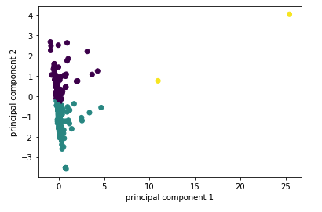

# Cryptocurrency Clusters

## Background

* On the Advisory Services Team of a financial consultancy of which I am part, one of our clients, a prominent investment bank, is interested in offering a new cryptocurrency investment portfolio for its customers. The company, however, is lost in the vast universe of cryptocurrencies. They’ve asked us to create a report that includes what cryptocurrencies are on the trading market and determine whether they can be grouped to create a classification system for this new investment.

* I have been handed raw data to use for the analysis. To begin the project, I first need to process it to fit the machine learning models. Since there is no known classification system, I used the unsupervised learning model. I also used several clustering algorithms to explore whether the cryptocurrencies can be grouped together with other similar cryptocurrencies. I then used data visualization to share my findings with the investment bank.

### Data Preparation

* I read the `crypto_data.csv` into Pandas. The dataset was obtained from [CryptoCompare](https://min-api.cryptocompare.com/data/all/coinlist).

* I then filtered for currencies that are currently being traded. Once done sorting, I then dropped the `IsTrading` column from the dataframe and removed all rows that have at least one null value. I also filtered for cryptocurrencies that have been mined. In order for your dataset to be comprehensible to a machine learning algorithm, its data should be numeric. Since the coin names do not contribute to the analysis of the data, I deleted the `CoinName` from the original dataframe.

* The next step in the data preparation was to convert the remaining features with text values, `Algorithm` and `ProofType`, into numerical data. I accomplished that task by using Pandas to create dummy variables with LabelEncoder and OneHotEncoder. 

* The dataset was then standardized so that columns that contain larger values do not unduly influence the outcome. This was then fit transformed as a fully scaled data set for further analysis.

### Dimensionality Reduction

* Creating dummy variables above dramatically increased the number of features in the dataset. I did perform dimensionality reduction with PCA. Rather than specifying the number of principal components when I instantiated the PCA model, I preserved 90% of the explained variance in dimensionality reduction. 

A PCA prediction was also executed and the results are shown as below:

The following graphs were plotted on the PCA data. These graphs represent plotly scatter plot showing the clusters with markers identifying the Coin name and Algorithm.

* Next, I further reduced the dataset dimensions with t-SNE and visually inspected the results. In order to accomplish this task, I run t-SNE on the principal components: the output of the PCA transformation. Then create a scatter plot of the t-SNE output.

### Cluster Analysis with k-Means

* I then created an elbow plot to identify the best number of clusters. Using a for-loop I was able to determine the inertia for each `k` between 1 through 10. Looking into the graph, I would say that the K-value at which the elbow of the plot is, k = 5.

### Recommendation

* Based on the findings, it may be advisable to run the analysis without Bitcoin data do if there will be a change in the elbow curve from optimal value standpoint. 
* Multiple additional analysis can also be conducted to other cryptocurrencies against Bitcoin to observe the behavior to understand how the impact will be on introducing new cryptocurrency and how the new cryptocurrency may be able to perform in the market place. 

